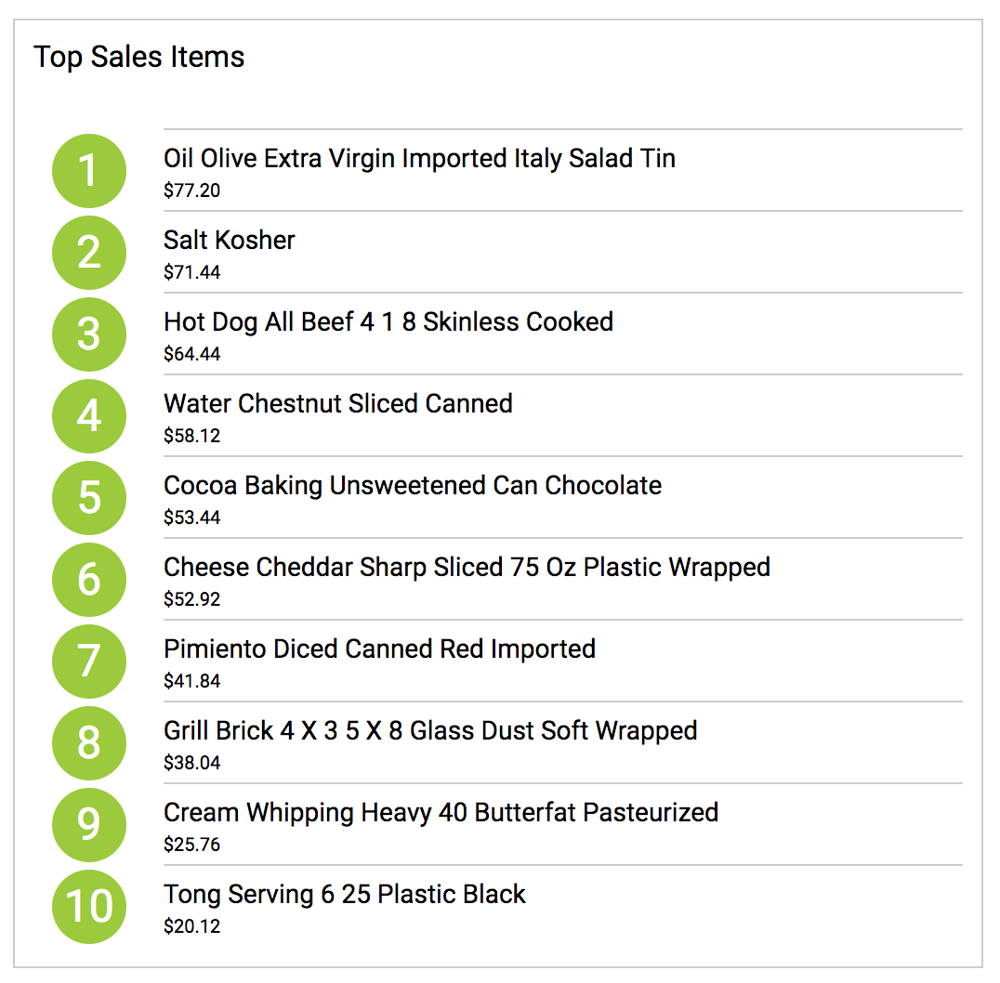

# HotSchedules Front-end Engineering Challenge



# How to use the component with jQuery and Angular

## Usage with jQuery
To use this component with jQuery, you will need to create a <div> in the desired spot that has the id 'top-sales'. For example:

```javascript
var topSalesContainer = $('<div id="top-sales"></div>');
containerToPlaceComponentIn.append(topSalesContainer);
```

Then create the react component like below. The important line is the ReactDOM.render() line, which targets the div with the top-sales id. You can use a different manner to pass in data if you wish, as long as it is passed into the topTen={} prop. Make sure you have react and react-dom installed.

```javascript
import React from 'react';
import ReactDOM from 'react-dom';
import request from 'request';
import TopSalesList from '../../dist/TopSalesList/index';
import transformData from '../../dist/Utils/transformData';

request.get('http://localhost:3000/PurchaseOrders', function (error, response, body) {
  const topTen = transformData(JSON.parse(body));
  ReactDOM.render(<TopSalesList topTen={topTen} />, document.getElementById('top-sales'));
});
```

Also make sure the bundled script is in your html file, such as:

```html
<script src="./build/bundle.js"></script>
```

[For more help, follow instructions here](https://facebook.github.io/react/docs/integrating-with-other-libraries.html)


## Usage with Angular
We can use [react2angular](https://github.com/coatue-oss/react2angular) to use our React component within an Angular app.

Make sure react2angular is installed and then expose the component to Angular.

```javascript
import { react2angular } from 'react2angular'
import TopSalesList from './your/path/to/dist/TopSalesList/index'

angular
  .module('myModule', [])
  .component('topSalesList', react2Angular(TopSalesList))
```

Then use the component and pass data into the topTen prop. The utility function in the transformData file might be helpful to format the data properly.

```javascript
<top-sales-list
  topTen={data}
></top-sales-list>
```

[For more help, follow instructions here](https://github.com/coatue-oss/react2angular)

## Narrative 

After realizing the user experience of their application suite is disjointed, shadowy upper-management figures
have bestowed the task of unifying them to you! You have decided there can only be one solution: you must build
a component library! The complexity grows as you ponder the problem; the Russian team uses Angular.js for their app,
the Columbian team uses React.js for theirs, and the hipster dev team in SF decided to use nothing but jQuery. How will
you form a comprimise to pacify all the share holders??? 

## Task

Though the execs want to see a full fledged library completed by end of quarter, they really just need to get one
component released to production for all the apps ASAP to apease a large customer. Typical. The component in question is 
a list which displays a customer's top selling items. Your job will be to create the component, keeping in mind it has to work
in a variety of environments.

Your product manager provides you with the requirements:

1. Display the top 10 selling products in order from most sold to least. 
2. Display the revenue of each product.

Your star designer provides you with awesome mocks:

[Mocks](https://drive.google.com/file/d/0B7KmJIsOVjr6YTcwMC11bTBnVGs/view?usp=sharing)

(Don't stress on being pixel perfect.)

Your backend team exposes an api:

* The route '/PurchaseOrders' returns the latest PurchaseOrders
* Each PurchaseOrder has an array of products PurchaseOrder.products
* each Product has an order_count and vendor_price property which can be used to calculate revenue

*hint* - revenue = Product.order_count * (Product.vendor_price.value / Product.vendor_price.scale)

*note* - You will notice vendor_price is an object with three properties: code, value, and scale. Code
is the type of currency. For performance reasons we don't save numbers with decimal points in the database. Instead,
the scale property holds the exponent of 10 by which to divide the value property by. So for example,
{value: 1000, scale: 2} is equivalent to 1000 / 10^2 => 1000 / 100 => $10.00.

## Getting Started 

Clone this repo.

`git clone git@bitbucket.org:redbookplatform/frontend-challenge.git`

Install. Set up npm if needed (http://blog.teamtreehouse.com/install-node-js-npm-mac).

`npm install`

Install global packages

`npm install webpack -g`

`npm install json-server -g`

Start your mock server

`json-server --watch ./data/db.json`

In separate terminal window use webpack to build your library as well as sandbox app.  

Webpack is a module bundler that bundles all your code into one file and compiles it
from Javascript ES6 to Javascript ES5.

`npm run build`

The build will re-run everytime you update your source.  

Write the TopSalesList component in 'src/top-sales-list'.

You can write a utility function to help transform the data from the server to a format more
conducive to your component if needed in 'src/utils/'.


